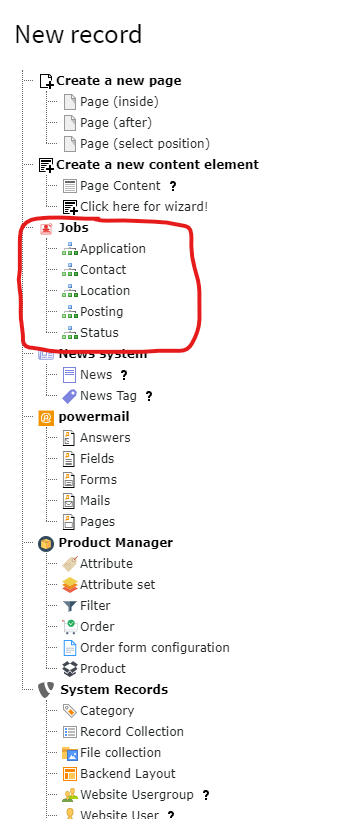
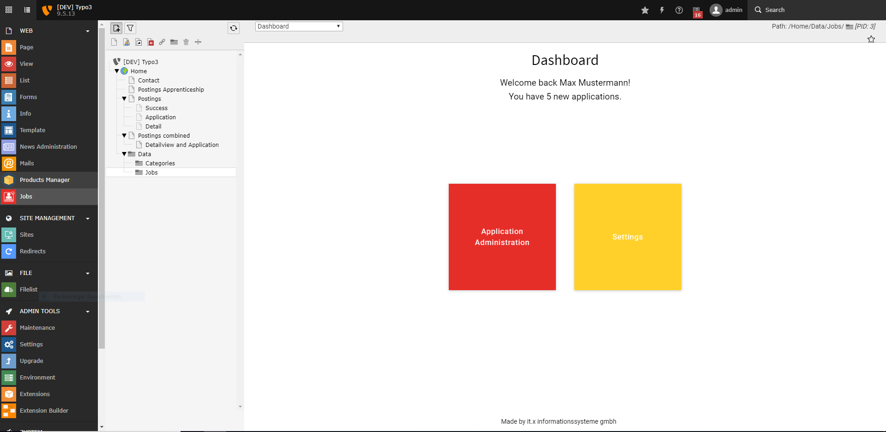
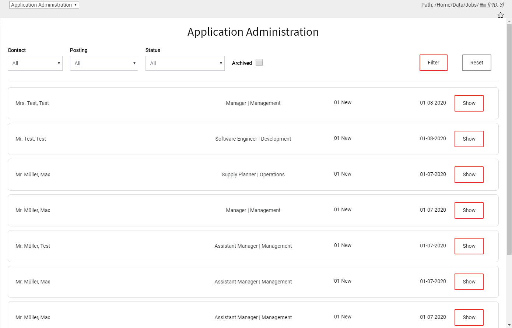
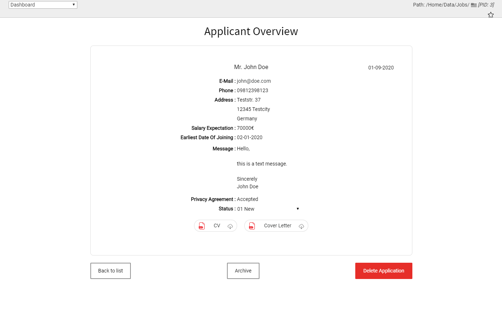

.. ==================================================
.. FOR YOUR INFORMATION
.. --------------------------------------------------
.. -*- coding: utf-8 -*- with BOM.

.. include:: ../Includes.txt

.. _editors:

================
For Editors
================

Setup records
====================
For adding records go into your folder(s) where you want to store the jobs system records via the List Module.

Click the '+' and you will be shown all the records that are available.

   The ones marked in red are created by the Jobs Extension.

Language and Hidden
-------------------
All of these records feature changing the language and hiding the element.

Contact Record
--------------
This Record is used to reference a contact person in a job posting.

Personal Information
~~~~~~~~~~~~~~~~~~~~
Enter the first- and lastname of the contact, their e-mail, phone, division and possibly a picture.
This data will then be displayed in the frontend, when this contact is referenced by a posting.

Backend User
~~~~~~~~~~~~
With this setting a backend user can be referenced. This is useful if the Jobs-Application-Managment-Backendmodule is
used as it allows the extension to personalize the experience.

Location Record
---------------
This record can also be referenced by a posting to provide information about the whereabouts of the position.

Name
~~~~
The location record expects a name, which will be shown in the frontend by default.
There is however a setting in the plugin settings of the *Detailview Plugin* to hide the name so only the address will
be shown and the name can be for internal use only.

Address
~~~~~~~
This is probably pretty self explanatory. These Fields are simply used to provide the address.

Latitude & Longitude
~~~~~~~~~~~~~~~~~~~~
These don't have an effect yet. It is planned however that these can be used to show a google map in the detailview
of the posting.

Posting Record
--------------
This is probably the most important record of this extension. With this record the actual job posting is created.
Keep in mind that apart from the title field every field that was left empty won't be displayed in the frontend.

Title & Division/Department
~~~~~~~~~~~~~~~~~~~~~~~~~~~
The Title is the main identifier of the posting.
The department field will be what defines the content of one of the filters. That means it would be best to fill this out.

Location & Contact
~~~~~~~~~~~~~~~~~~
These are both of the fields that were mentionend before. They reference the Location and Contact record.
One of each type can be selected of all of the records previously created.

Date Posted & Valid Through
~~~~~~~~~~~~~~~~~~~~~~~~~~~
These two dates are not only displayed in the frontend but also decide. When the posting is published or taken down again.
The *Valid through* field is optional, meaning it can stay empty which results in the posting staying active until its
manually taken down.

Base Salary
~~~~~~~~~~~
This is another optional entry. You may enter numbers as well as text. This entry is especially useful for Google Jobs.
The extension will fetch the input value if available automatically and assign the currency defined in the Extension Settings.

This means any currency input into this field is only for cosmetics in the frontend. The actual currency must be defined
in the Extension Settings.
This behaviour may be improved in the future.

Career Level
~~~~~~~~~~~~~
This field defines what level the career level of the applicant should be.

Examples for this could be: career starters, professionally experienced, ...

Employment Type
~~~~~~~~~~~~~~~
This setting has a select list should cover ever type, as they are copied from Google Jobs, which means the types
do correspond directy with the ones used for Google Jobs.

Terms of Employment
~~~~~~~~~~~~~~~~~~~
This field can be used to describe the terms in a simple and short way.

E.g.: fixed-term contract, temporary-contract, open-ended contract

Slug
~~~~
In the advanced settings tab you can find the slug. This represents how the url of this posting will look like.
It will be automatically generated when the posting is saved, but it is also possible to specify it yourself.

Texts
~~~~~
In this tab the actual content of the posting is specified.
There are a multitude of sections available. These can be filled via the Rich Text Editors on an as-needed basis.

Images
~~~~~~
In this tab both of the posting Images can be specified.
The posting can have a Listview Image, which as the name says will only be dispayed in the list view, and a
Detailview Image, which represents a header picture in the default Bootstrap template.

Categories
~~~~~~~~~~
Every posting can be assigned to one or more typo3 categories. These are system records that have to be created manually.
These can be created in a seperate folder for the sake of clarity. Then they will show up in this tab, ready to be
activated.

.. _status_record:

Status Record
-------------
These records are only of good use if you use the Application-Managment-Backend-Module. They serve an organizational
purpose.

Each application can have a status. When a new application arrives it is then assign the first status. Which one this is
can be specified via a settings in the status record. This setting should only be enabled once in all of the statuses
to ensure the system is working correctly.

Each status has follower statuses, which enables you to build your own workflows.
Because its quite time consuming to create all of those statuses yourself an option to import a stack of default
statuses is included.
This form can be found in the settings of the Backend Module.

There is also a settings in the status record that, if enabled makes the status an end status. This means the applications
in this status are cleared to leave the system via either being deleted or anonymized by tasks executed by the scheduler.
The behaviour of these tasks can be specified when creating the task (:ref:`tasks`).

Application Record
------------------
The application records should not be created manually as they are created automatically when an applicant applies.
Because the layout of the Backend List Module is quite complex for reading the applications there we developed a
backend module which is explained in the following section.

Application Managment
=====================
You can find the Application Managment by clicking the **Jobs Module**.

If your backend user account is connected to a Jobs Extension Contact you
will be greeted with the number of new applications.

   The "dasboard" in the backend module

If you have admin rights you will see a *Settings* Button. This is only for importing Statuses at the moment.
Otherwise you have a single button *Application Administration*. Clicking it will bring you directly to the
Application-Overview.

Application Overview
--------------------

   The application administration overview

Here, all applications are visible. To make things easier there are some filters implementented, which should
help the recruiter to have a view of the exact applications he/she wants to see.
As already mentioned above there is a
status system implemented. In the list overview the status can be clicked on to select the new status, resulting in
the status changing instantly.

It is also possible to click on the job posting in the middle of the entry to filter for this exact posting.
To read the whole application in more detail you can click either on the *name of the applicant* on the left or the
*Show* button on the right.

Application Detail view
-----------------------

In this view all of the information available from the application is displayed.

   Detail view

In the same way as in the overview, the status is changeable here as well.
Below the information the files, which the applicant uploaded via the application form are presented.
These can simply be downloaded by clicking on the corresponding button.

There is another function to organize the applications: With a click on *Archive* the application will not be shown
anymore in the overview. You can see if the application was archived by looking at the grey background visible in the
detail view as well as in the list view.

Also there is a button *Delete Application* to remove the application from the system. This removes the application
record and all files related to this application. This is irreversible.

