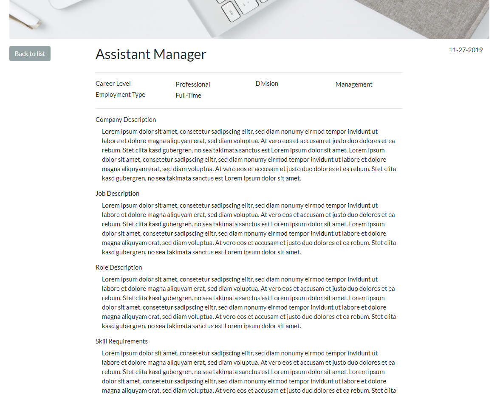
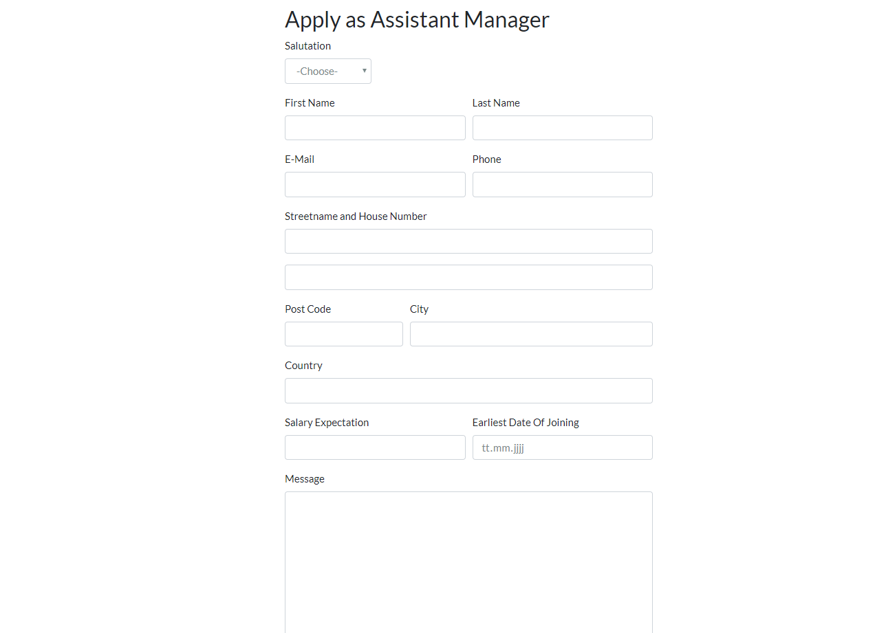

.. include:: ../Includes.txt

.. _introduction:

============
Introduction
============

What does it do?
================

This extension provides you with the ability to create and manage job postings.

People can apply to a posting by using the supplied application form resulting in the referenced contact receiving the application via
email and/or the backend module, which features a basic application management system.

.. _features:

Features
========

Manage job postings
-------------------

	* list view and detail page
	* create location records and contact person records to link with the job posting
	* shipped with a bootstrap layout, which provides easy customizability
	* comes with a bootstrap.css file so it **works out of the box**
	* add images for the list and detail view
	* write your own page title for the detail page by using placeholders
	* use **frontend filters** for job posting attributes "Division", "Career Level", "Emplyoment Type" and "Location"
	* time at which date the posting should go live and possibly end
	* support for **TYPO3 categories**
	* OpenGraph data automatically populated
	* Structured data for **Google Jobs integration**
	* **Google Indexing API Implementation** for Google Jobs: Sends crawl requests automatically when editing a job posting, so Google Jobs always has the latest data

Application Form
----------------

	* **fully fledged application form** with standard fields like name, email, phone, address as well as optional fields like "Salary Expectation", "Earliest Date of Joining" and a "Message" field.
	* supports pdf file uploads
	* have four single file upload fields or one multi file upload field
	* privacy agreement checkbox, which links to your privacy agreement page
	* forward the applicant to a success page with a customized message which again supports placeholders for the applicants name

Application Management
----------------------

	* configure if an email should be sent to the referenced contact and/or a specific email address
	* configure if the applicant should receive a confirmation email, where the text can be specified with the use of placeholders.
	* supports **application status managment**
	* configurable **scheduler tasks** for application deletion and anonymization based on age and status
	* option to not save the application and only send the emails
	* **Backend module** for viewing, sorting, filtering, archiving and deleting the applications
	* link a jobapplications extension contact person to a backend user to have a personalized experience viewing the applications

.. _screenshots:

Screenshots
===========

   Screenshot of list page

   Screenshot of the job postings detail page

   Screenshot of the application form

This is how the standard bootstrap frontend will look like.

Of course you can easily override these templates via typoscript.